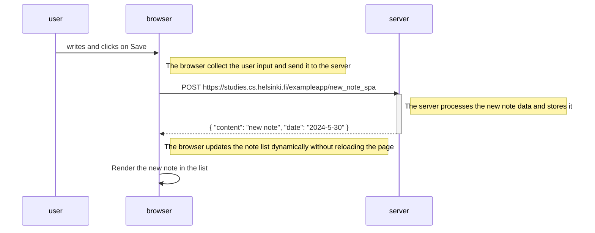

```mermaid
sequenceDiagram
    participant user
    participant browser
    participant server

    user->>browser: writes and clicks on Save
    Note right of browser: The browser collect the user input and send it to the server

    browser->>server: POST https://studies.cs.helsinki.fi/exampleapp/new_note_spa 
    activate server
    Note right of server: The server processes the new note data and stores it
    server-->>browser: { "content": "new note", "date": "2024-5-30" }
    deactivate server

    Note right of browser: The browser updates the note list dynamically without reloading the page
    browser->>browser: Render the new note in the list

```